# API REST versionada con PHP y Swagger

Proyecto de API REST desarrollado en PHP con versionado de endpoints.
Actualmente incluye:
- API v1: usuarios, productos y login básico.
- API v2: autenticación mediante Bearer Token, usuarios protegidos, productos protegidos y endpoint `/me`.
- API v3: gestión de tareas bajo enfoque API-First.
- Documentación interactiva con Swagger UI mediante `swagger-ui-express`.
---
# Requisitos
Para ejecutar el proyecto localmente se requiere:
- XAMPP
- Apache
- MySQL
- PHP
- Node.js
- npm
- Postman
---
# Base de datos
La base de datos utilizada localmente es: tap
El proyecto utiliza las siguientes tablas:
- usuarios - v1
- productos - v2
- api_users - v2
- api_tokens - v2
- tareas - v3
La estructura de las tablas se encuentra en: database.sql
# Configuración de base de datos
El archivo: config/database.local.php
contiene la configuración local de conexión.
Ejemplo:
    <?php

    return [
        'host' => 'localhost',
        'db_name' => 'tap',
        'username' => 'root',
        'password' => '',
        'token_expiration_minutes' => 60
    ];
Este archivo no se incluye en GitHub. Como referencia se proporciona: config/database.example.php
# Levantar la API localmente
1.- Copiar o clonar el proyecto dentro de: C:\xampp\htdocs\api
2.- Iniciar Apache y MySQL desde XAMPP.
3.- Crear la base de datos tap.
4.- Ejecutar el contenido de: database.sql
5.- Crear el archivo:
6.- config/database.local.php

con las credenciales correspondientes.

# Endpoints API v1
Base URL local: http://localhost/api/public/api/v1
Ejemplos:
GET    /users
GET    /users/{id}
POST   /users
PUT    /users/{id}
DELETE /users/{id}
GET    /productos
GET    /productos/{id}
POST   /productos
PUT    /productos/{id}
DELETE /productos/{id}
POST   /login

# Endpoints API v2
Base URL local: http://localhost/api/public/api/v2
Autenticación:
POST /login
POST /logout
GET  /me

Usuarios protegidos:
GET    /users
GET    /users/{id}
POST   /users
PUT    /users/{id}
DELETE /users/{id}

Productos protegidos:
GET    /productos
GET    /productos/{id}
POST   /productos
PUT    /productos/{id}
DELETE /productos/{id}

Los endpoints protegidos requieren: Authorization: Bearer TOKEN

# API v3 - Gestión de Tareas
La API v3 fue desarrollada utilizando un enfoque API-First.
Antes de implementar el servidor se diseñó el contrato mediante OpenAPI.
El archivo del contrato se encuentra en: openapi/v3/openapi.yaml
Base URL local: http://localhost/api/public/api/v3
Endpoints:
GET  /tareas
GET  /tareas/{id}
POST /tareas
PUT  /tareas/{id}

Modelo de una tarea:
    {
    "id": 1,
    "titulo": "Estudiar API-First",
    "completada": false,
    "fecha_creacion": "2026-09-08 14:24:30"
    }

# Swagger UI
## Opción local con swagger-ui-express
La documentación interactiva utiliza:
- Express
- swagger-ui-express
- yamljs

Las dependencias se encuentran definidas en: swagger/package.json
Para instalar las dependencias:
1.- cd swagger
2.- npm install
Para iniciar Swagger:
3.- node server.js
Swagger UI estará disponible en: http://localhost:3000/api-docs
Desde Swagger es posible probar directamente los endpoints de la API v3.

## Opción estática con Apache
También se incluye una versión de Swagger UI que no requiere Node.js ni instalación de dependencias en el servidor.
Abrir localmente: http://localhost/api/public/api-docs/
En producción: http://topicosweb.celaya.tecnm.mx/21030466/api/public/api-docs/
Esta versión carga el contrato OpenAPI desde: public/api-docs/openapi/openapi.yaml

# Pruebas con Postman
La API v3 fue probada utilizando Postman.
POST http://localhost/api/public/api/v3/tareas
Body:
    {
    "titulo": "Completar Tarea de Ciberseguridad",
    "completada": false
    }
Ejemplo para listar tareas:
GET http://localhost/api/public/api/v3/tareas

# Evidencia de Swagger
- Vista general de Swagger UI con los endpoints de la API v3:
    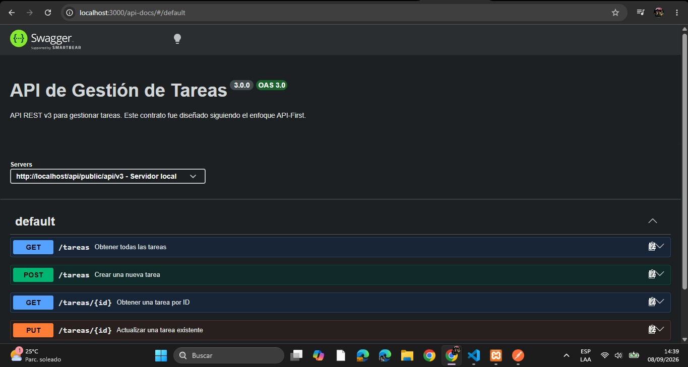
- Prueba de creación de una tarea desde Swagger:
    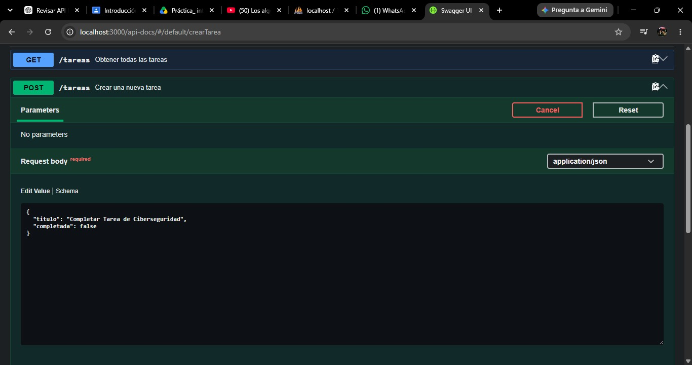
    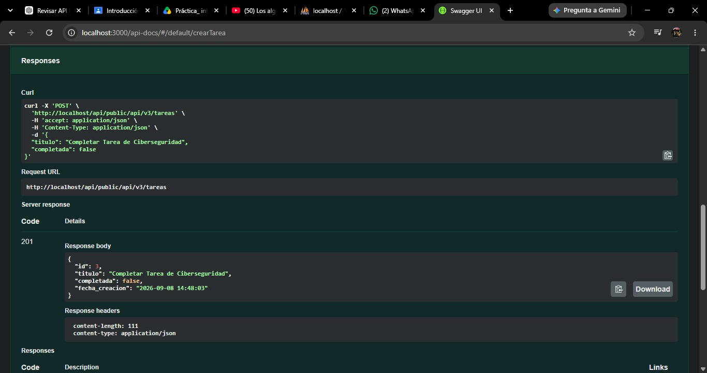
- Prueba de listado de tareas
    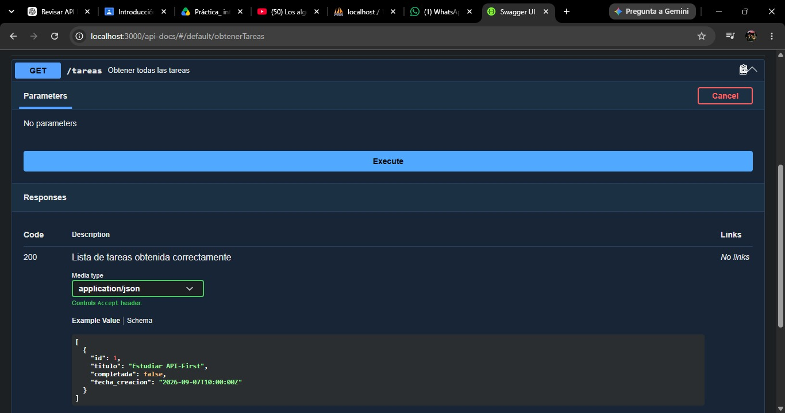
    
- Prueba de consulta de una tarea
    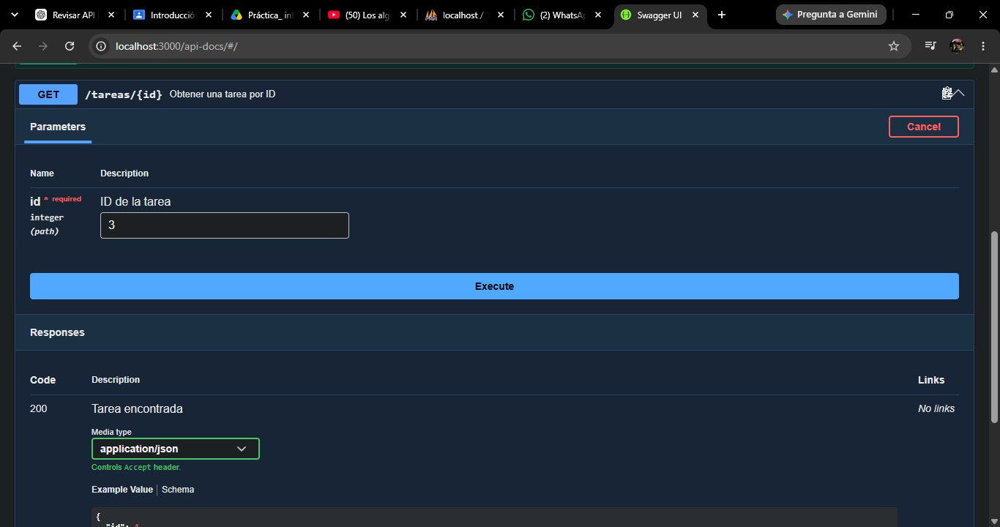
    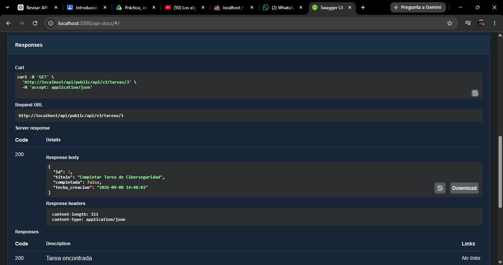
- Prueba de actualizacion de una tarea
    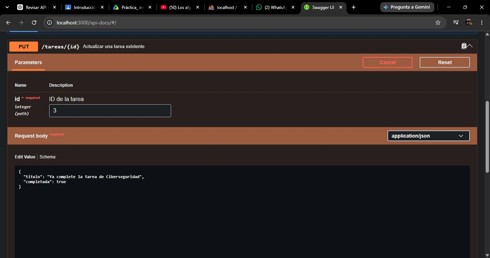
    

# Evidencia de Postman
- Creación de una tarea:
    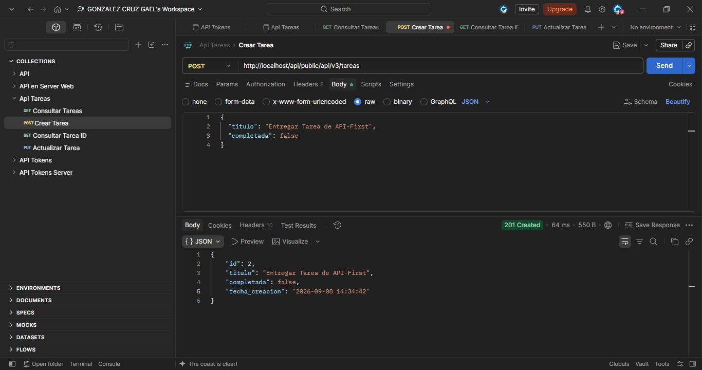
- Listado de tareas:
    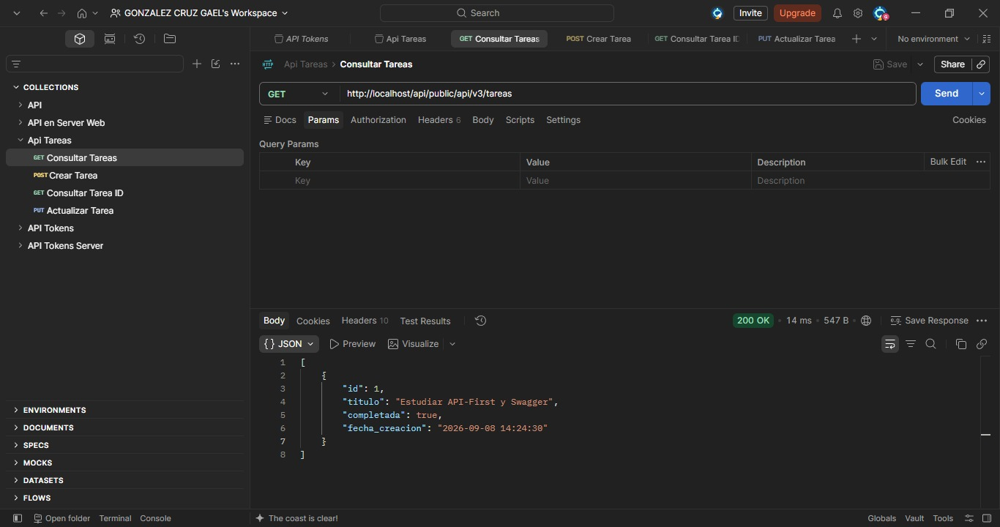
- Consulta de una tarea:
    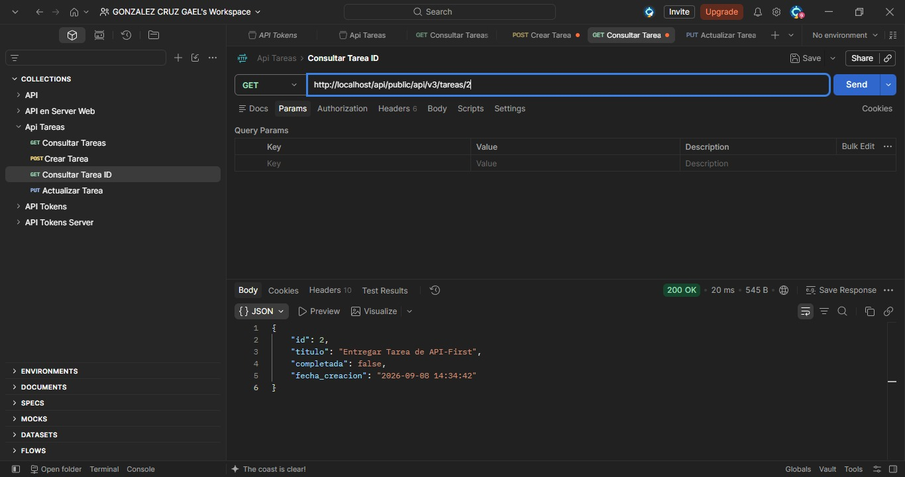
- Actualizacion de una tarea:
    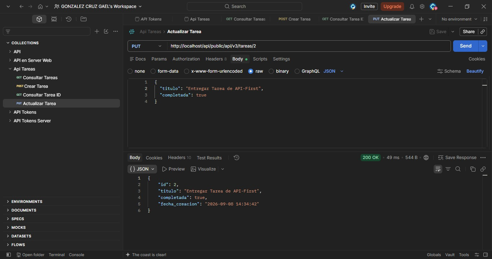

# Servidor de producción
La API también se despliega en el servidor de la clase.
Las versiones v1, v2 y v3 se mantienen disponibles de forma independiente mediante versionado de rutas.

La API v3 utiliza: /api/v3/tareas
La documentación Swagger utiliza la ruta: /api-docs